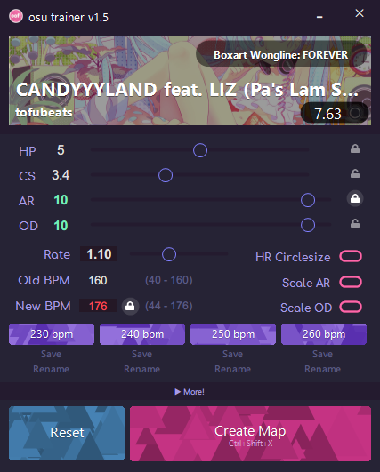

# osu-trainer
A program that allows you to modify the difficulty of a beatmap **very quickly and easily**.

### Additional Notes
+ Maps can be created without alt tabbing if you make good use of the profiles and hotkeys
+ Search "osutrainer" in osu! to find all your generated maps
+ If you use this application a lot, you can end up using a lot of disk space. (333 mp3s * 3MB/mp3 = 1GB). To free up this space, delete the generated maps in osu, then click the Clean Up button in osu trainer.

Special thanks to [Craftplacer](https://github.com/Craftplacer) for making the UI really nice and pretty

## Licenses
This project uses the following projects:
- [Font Awesome](https://fontawesome.com/), [licensed under the CC BY 4.0 License](https://creativecommons.org/licenses/by/4.0/)
- [Comfortaa](https://fonts.google.com/specimen/Comfortaa), [licensed under the Open Font License](https://scripts.sil.org/cms/scripts/page.php?site_id=nrsi&id=OFL)
- [osu-resources](https://github.com/ppy/osu-resources), [licensed under the CC BY 4.0 License](https://creativecommons.org/licenses/by-nc/4.0/legalcode)
- [oppai-ng](https://github.com/Francesco149/oppai-ng), [licensed under the Unlicense](https://github.com/Francesco149/oppai-ng/blob/master/UNLICENSE)
- [ProcessMemoryDataFinder](https://github.com/Piotrekol/ProcessMemoryDataFinder), [licensed under GPL-3.0](https://github.com/Piotrekol/ProcessMemoryDataFinder/blob/master/LICENSE)
- [LAME](https://lame.sourceforge.io/)
